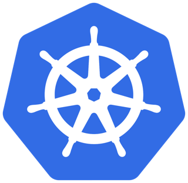
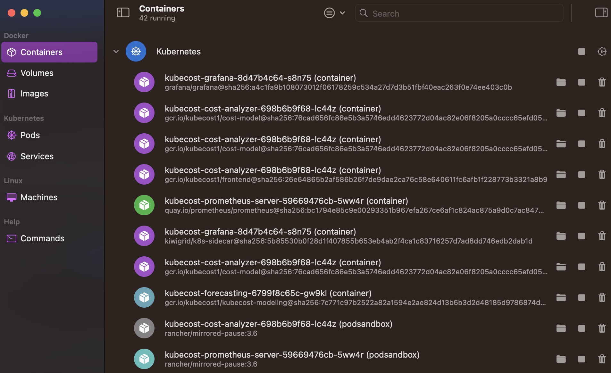

# Kubernetes

Useful K8 Projects under CNCF explored under this single repository.

## Setup Local K8 Cluster with Orbstack
I recommend using [OrbStack](https://orbstack.dev/) to setup your own personal local K8 Cluster to work with.

More details on K8 using OrbStack can be found [here](https://docs.orbstack.dev/kubernetes/)

## Building a K8 Platform with Helm & CNCF Projects

| Projects     | Purpose                          | Completed |
| -------------| -------------------------------- | --------- |
| [Argo CD](argocd/readme.md)       | GitOps continuous delivery tool for K8        | Yes        |
| [Jupyterhub](jupyterhub/readme.md)   | Analytics application for users  | Yes        |
| [Fluentbit](fluentbit/readme.md)    | Log metrics and logs in K8       | Yes        |
| Kyverno      | Policies to secure K8            | No        |
| Istio        | Service Mesh for K8              | No        |
| KubeCost     | Monitor Cost of Resources        | No        |
| KubeFlow     | ML Toolkit for Kubernetes        | No        |

