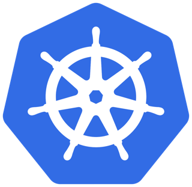
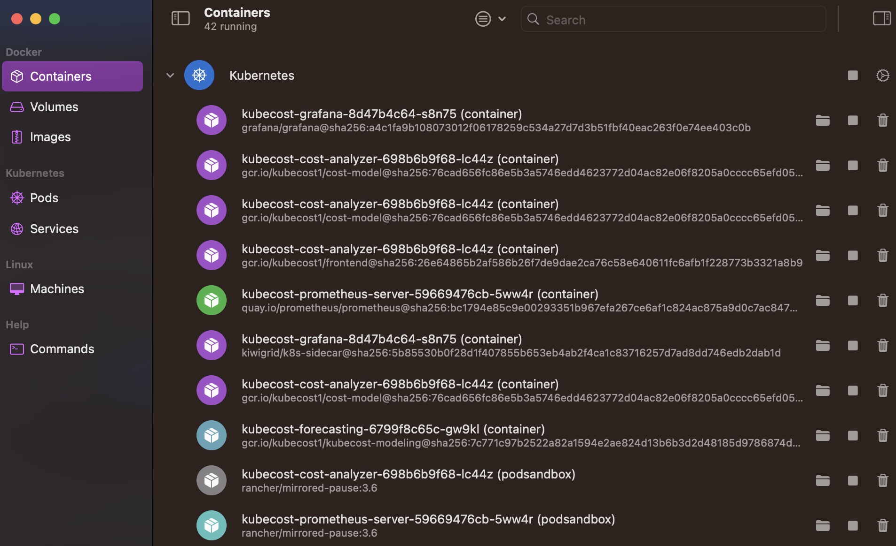
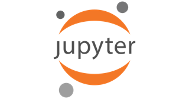
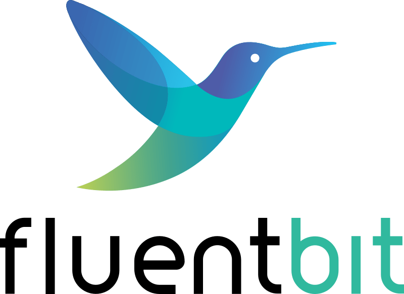
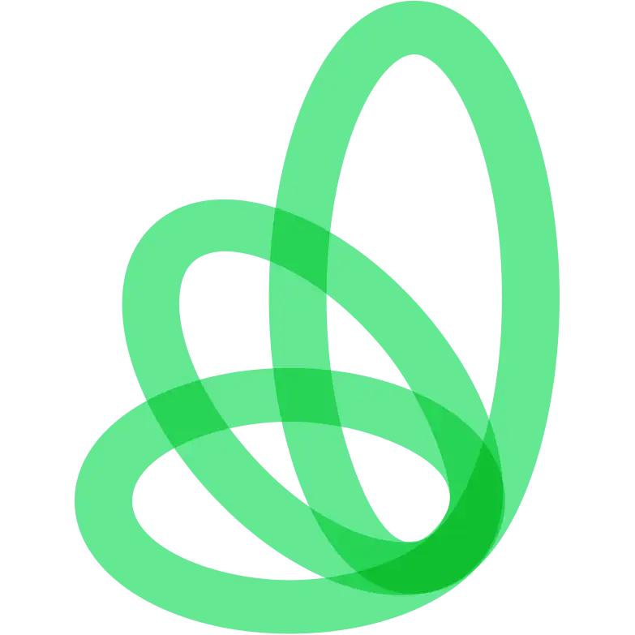
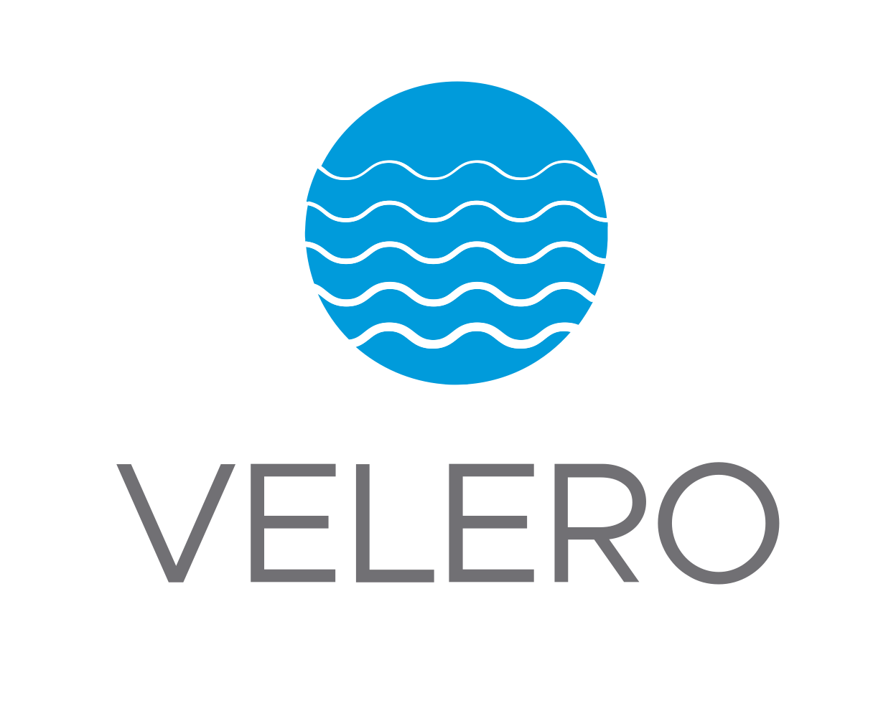

# Kubernetes

Useful K8 Projects under CNCF explored under this single repository.

## Setup Local K8 Cluster with Orbstack
I recommend using [OrbStack](https://orbstack.dev/) to setup your own personal local K8 Cluster to work with.

More details on K8 using OrbStack can be found [here](https://docs.orbstack.dev/kubernetes/)

## Building a K8 Platform with Helm & CNCF Projects

|                              | Projects                             | Purpose                                | Completed | Official Documentation |
|---------| -------------------------------------| -------------------------------------- | --------- | ------------ |
|  | [Argo CD](k8/argocd/readme.md)       | GitOps continuous delivery tool for K8 | Yes       | [Link](https://argoproj.github.io/cd/)              |
|  | [Jupyterhub](k8/jupyterhub/readme.md) | Analytics application for users        | Yes       | [Link](https://z2jh.jupyter.org/en/stable/)              |
|  | [Fluentbit](k8/fluentbit/readme.md)  | Log and metrics in K8                  | Yes       | [Link](https://fluentbit.io/)             |
|  | [Kyverno](k8/kyverno/readme.md)      | K8 Policy Management for Security      | Yes       | [Link](https://kyverno.io/)              |
|  | [Istio](k8/istio/readme.md)          | Service Mesh for K8                    | Yes       | [Link](https://istio.io/ )             |
|  | [KubeCost](k8/kubecost/readme.md)    | Monitor Cost of Resources              | Yes       | [Link](https://www.kubecost.com/)              |
|  | [KServe](k8/kserve/readme.md)                             | Serve ML models              | Yes        | [Link](https://kserve.github.io/website/latest/)             |
|  | [Velero](k8/velero/readme.md)        | Backing up Kubernetes Resources        | Yes       | [Link](https://velero.io/)              |

