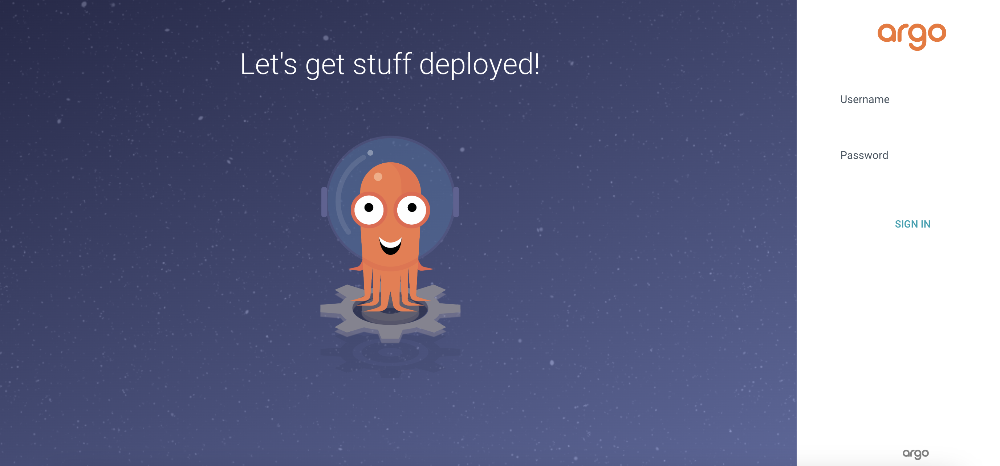
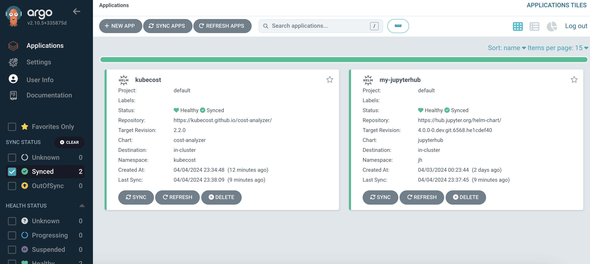
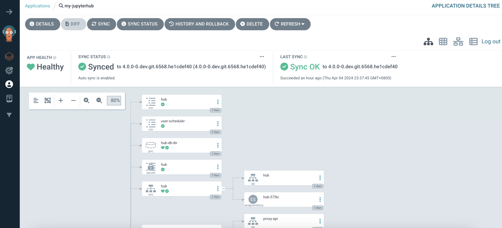

## [Back to Top](../README.md)

# Argo CD 
## A GitOps Continuous Delivery Tool


## Table of Content
* **[Introduction](#introduction)**
* **[Getting Started with Argo CD](#getting-started-with-argo-cd)**
    * **[Create argocd namespace](#create-argocd-namespace)**
    * **[HELM Installation](#helm-installation)**
    * **[Network Setup](#network-setup)**
* **[Benefits](#benefits)**
    * **[Manage Applications Centrally](#benefits)**
    * **[Monitor Applications](#benefits)**

### Introduction
[Argo CD](https://argoproj.github.io/cd/) is a declarative, GitOps continuous delivery tool for Kubernetes. With Argo CD, application deployment and lifecycle management can be automated, auditable, and easy to understand which is the often the number one concern in the minds of various dev teams.

### Getting Started with Argo CD
#### Create argocd namespace
We need a namespace to deploy argocd into. Run the following;
```bash
kubectl create ns argocd
```

#### HELM Installation

```bash
helm repo add argo https://argoproj.github.io/argo-helm

helm upgrade my-argo-cd argo/argo-cd --version 6.7.8 --values values.yaml --namespace argocd
```

#### Network Setup
In order to access the server UI you have the following options:

1. kubectl port-forward service/my-argo-cd-argocd-server -n argocd 8080:443

    and then open the browser on http://localhost:8080 and accept the certificate

2. enable ingress in the values file `server.ingress.enabled` and either
   
    - Add the annotation for ssl passthrough: https://argo-cd.readthedocs.io/en/stable/operator-manual/ingress/#option-1-ssl-passthrough
    
    - Set the `configs.params."server.insecure"` in the values file and terminate SSL at your ingress: https://argo-cd.readthedocs.io/en/stable/operator-manual/ingress/#option-2-multiple-ingress-objects-and-hosts

I went with option 2 and amended my `values.yaml` file accordingly. You can then launch the application locally `http://my-argo-cd-argocd-server.argocd.svc.cluster.local`. Note that if you want to access via https you would need to setup your SSL Certificate accordingly.

After reaching the UI the first time you can login with username: admin and the random password generated during the installation. You can find the password by running:
```bash
kubectl -n argocd get secret argocd-initial-admin-secret -o jsonpath="{.data.password}" | base64 -d
```
My own local credentials I had set are shown below
```bash
username: admin
password: P@ssword
```



### Benefits

#### Manage Applications Centrally
Argo CD simplifies application management by providing a central location to deploy and manage your applications across multiple Kubernetes clusters.  With Git as the single source of truth, you can leverage familiar Git workflows like version control, pull requests, and rollback to previous deployments. This streamlines collaboration and ensures consistency across environments.



#### Monitor Applications
Argo CD keeps a watchful eye on your applications. It continuously monitors the deployed state of your applications and compares it to the desired state defined in your Git repository. This real-time health check allows you to identify any discrepancies or errors and take corrective action before they impact your users. Additionally, Argo CD provides detailed information on application health and resource utilization, giving you valuable insights into application performance.

