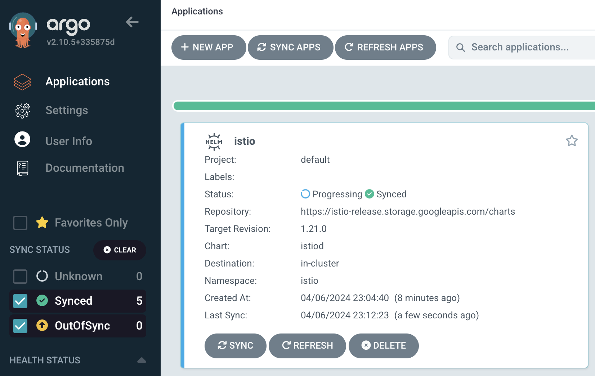

## [Back Home](../../README.md)

# Istio
## Simplify observability, traffic management, security, and policy with the leading service mesh


## Table of Content
* **[Introduction](#introduction)**
* **[Getting Started with Istio](#getting-started-with-istio)**
    * **[Create istio namespace](#create-istio-namespace)**
    * **[HELM Installation](#helm-installation)**
        * **[Option 1: Via Terminal](#option-1-via-terminal)**
        * **[Option 2: Via Argo CD](#option-2-via-argo-cd)**
* **[Benefits of Istio](#benefits-of-istio)**
    * **[Simplified and Secure Communication](#1-simplified-and-secure-communication)**
    * **[Enhanced Traffic Control and Monitoring](#2-enhanced-traffic-control-and-monitoring)**
    * **[Flexible Deployment and Extensibility](#3-flexible-deployment-and-extensibility-optional)**

* **[Resources](#resources)**

## Introduction
Istio simplifies managing communication between microservices in Kubernetes environments. It provides features like automatic load balancing, service-to-service security with encryption and authentication, and traffic control without requiring changes to your application code. Additionally, Istio offers automatic monitoring and integrates with various deployment configurations. 


## Getting Started with Istio

### Create istio Namespace
Create required namespace for Istio resources to be placed under.
```bash
kubectl create ns istio
kubectl create ns istio-system
```

### Helm Installation

#### Option 1: Via Terminal
Run the following helm commands in terminal to install istio application into your K8 cluster.
```bash
helm repo add istio https://istio-release.storage.googleapis.com/charts
helm repo update

helm install <release> <chart> --namespace <namespace> --create-namespace [--set <other_parameters>]

```
#### Option 2: Via Argo CD
If you are versed in Argo CD you may proceed to launch the Istio helm chart via the platform accordingly.




## Benefits of Istio

Istio simplifies service mesh management for microservices in Kubernetes. It empowers developers and operations teams with the following key advantages:

### **1. Simplified and Secure Communication**  

Istio automatically handles load balancing for various traffic types (HTTP, gRPC, etc.) and enforces strong service-to-service communication security using TLS encryption and authentication. This eliminates the need for manual configuration and streamlines secure communication within your microservices architecture.

### **2. Enhanced Traffic Control and Monitoring**

Istio provides fine-grained control over service communication behavior through rich routing rules, failovers, retries, and fault injection capabilities. It also offers automatic metrics, logs, and traces for all traffic within the cluster, simplifying performance monitoring and troubleshooting.  

### **3. Flexible Deployment and Extensibility (Optional)**

Istio integrates seamlessly with diverse deployment needs. You can extend your service mesh beyond the initial Kubernetes cluster, manage applications deployed outside Kubernetes, or connect virtual machines as endpoints. This flexibility empowers you to adapt Istio to your specific infrastructure requirements. (Consider including this subsection if extensibility is a significant benefit for your target audience.)


## Resources
- [Istio GitHub](https://github.com/istio/istio)
- [Istio Official](https://istio.io/latest/)


#### [Back to Top](#back-home)