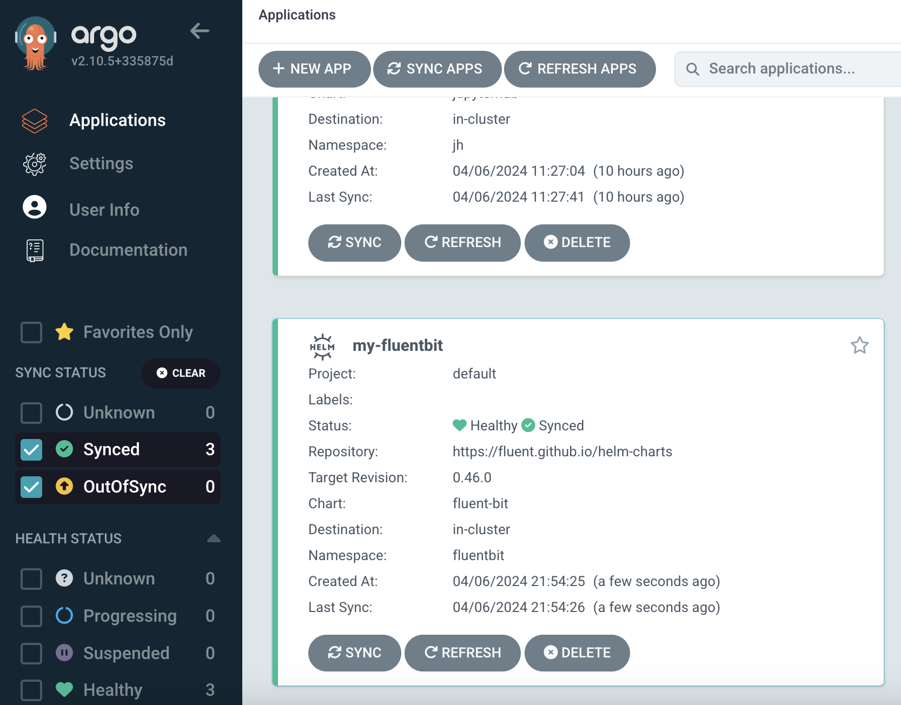

## [Back Home](../../README.md)

# Fluent Bit
## An End to End Observability Pipeline


## Table of Content
* **[Introduction](#introduction)**
* **[Getting Started with Fluentbit](#getting-started-with-fluentbit)**
    * **[Create fluentbit namespace](#create-fluentbit-namespace)**
    * **[HELM Installation](#helm-installation)**
        * **[Option 1: Via Terminal](#option-1-via-terminal)**
        * **[Option 2: Via Argo CD](#option-2-via-argo-cd)**
* **[Benefits of Fluentbit](#benefits-of-fluentbit)**
    * **[1. Unmatched Performance and Efficiency](#1-unmatched-performance-and-efficiency)**
    * **[2. Flexibility and Customization](#2-flexibility-and-customization)**
    * **[3. Ease of Use and Scalability](#3-ease-of-use-and-scalability)**
* **[Resources](#resources)**

## Introduction
Fluent Bit is a super fast, lightweight, and highly scalable logging and metrics processor and forwarder. It is the preferred choice for cloud and containerized environments. Fluentbit is part of a large open source community with no vendor lock-in.

## Getting Started with Fluentbit

### Create fluentbit Namespace
Create a namespace for fluentbit resources to be placed under.
```bash
kubectl create ns fluentbit
```

### Helm Installation

#### Option 1: Via Terminal
Run the following helm commands in terminal to install my-fluentbit application into your K8 cluster.
```bash
helm repo add fluent https://fluent.github.io/helm-charts
helm repo update

helm upgrade --install fluent-bit fluent/fluent-bit --namespace fluentbit
```
#### Option 2: Via Argo CD
If you are versed in Argo CD you may proceed to launch the Fluentbit helm chart via the platform accordingly.




## Benefits of Fluentbit

Fluent Bit is a lightweight log processor and forwarder gaining traction in the world of log management. Here's a breakdown of its key benefits that make it a compelling choice for various log processing needs.

### **1. Unmatched Performance and Efficiency:**

* **Low Memory Footprint:** Written entirely in C, Fluent Bit boasts a minimal memory footprint, typically consuming less than 1MB per instance. This is significantly lower compared to other log processors, making it ideal for resource-constrained environments like containers and embedded systems.
* **High Throughput:** Fluent Bit excels at handling large volumes of log data with minimal latency. This ensures efficient log collection and forwarding, even during peak loads.
* **Event-Driven Architecture:** Its event-driven architecture leverages the operating system's API for optimal performance and reliability. This approach minimizes processing overhead and ensures efficient handling of log events.

### **2. Flexibility and Customization:**

* **Pluggable Architecture:** Fluent Bit offers a robust plugin ecosystem with a wide variety of input, filter, and output plugins. This allows for flexible customization and integration with various data sources, processing needs, and output destinations. You can tailor your log processing pipeline to handle specific log formats, enrich data with filters, and route logs to diverse destinations like Elasticsearch, Kafka, or Splunk.
* **Stream Processing Capabilities:** Fluent Bit goes beyond simple log forwarding. It allows for basic data transformation and aggregation using filters. This stream processing functionality can help pre-process log data before sending it to downstream systems, potentially improving efficiency and reducing load on analysis tools.

### **3. Ease of Use and Scalability:**

* **Simple Configuration:** Fluent Bit configuration is straightforward and uses human-readable text files. This makes it easier to set up and manage your log processing pipeline compared to tools with complex configuration mechanisms.
* **Horizontal Scalability:** Fluent Bit scales effortlessly by adding more instances. This allows you to handle increasing log volumes by distributing the workload across multiple processors, ensuring efficient log management for growing environments.

## Resources
- [Fluent GitHub](https://github.com/fluent)
- [Fluentbit Helm Charts Repo](https://github.com/fluent/helm-charts)


#### [Back to Top](#back-home)