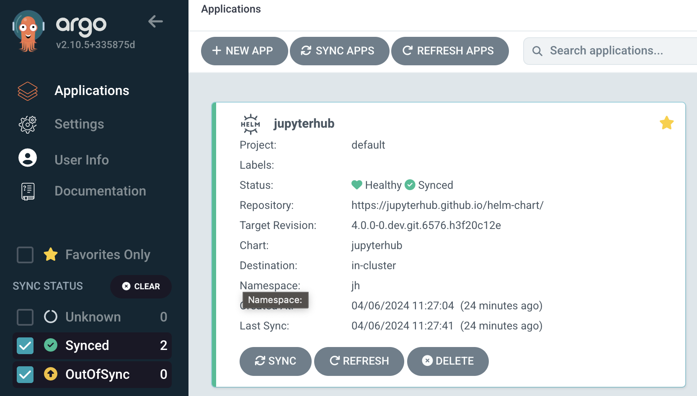
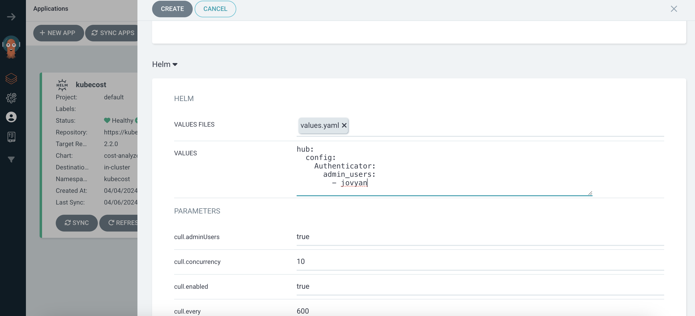
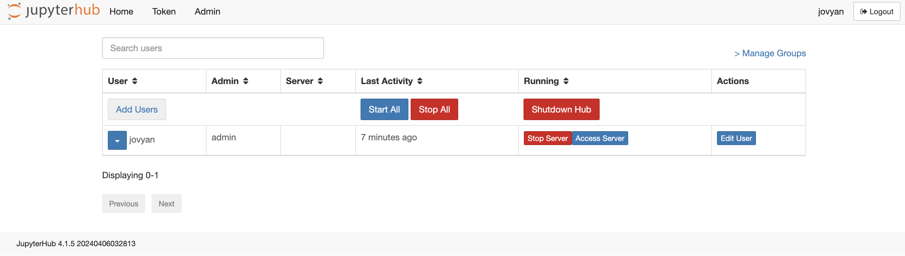
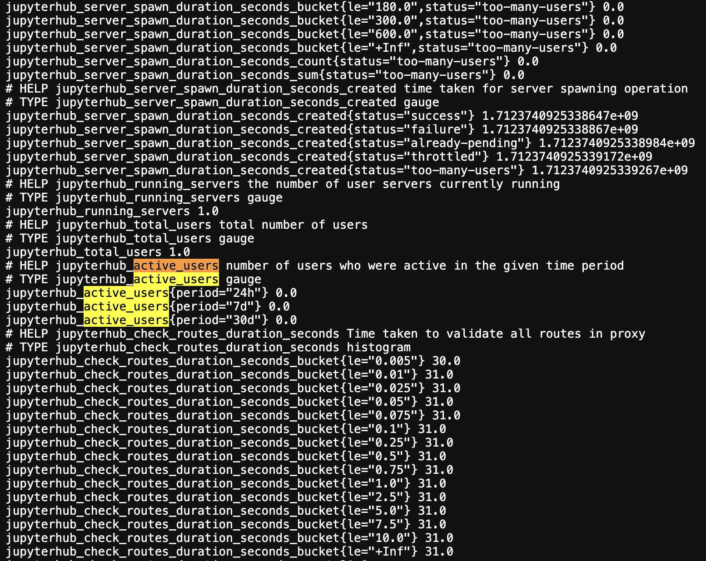

## [Back Home](../../README.md)

# Jupyterhub
## Notebooks for users to work with Data


## Table of Content
* **[Introduction](#introduction)**
* **[Getting Started with Jupyterhub](#getting-started-with-jupyterhub)**
    * **[Create jh namespace](#create-jh-namespace)**
    * **[HELM Installation](#helm-installation)**
        * **[Option 1: Via Terminal](#option-1-via-terminal)**
        * **[Option 2: Via Argo CD](#option-2-via-argo-cd)**
    * **[Login to Jupyterhub](#network-setup)**
    * **[Jupyterhub Admin](#network-setup)**
    * **[Jupyterhub Metrics](#network-setup)**
* **[Benefits of Jupyterhub](#benefits-of-jupyterhub)**
    * **[Simplified Collaboration](#simplified-collaboration)**
    * **[Streamlined Workflows](#streamlined-workflows)**
    * **[Scalibility and Resource Management](#scalability-and-resource-management)**
* **[Resources](#resources)**

## Introduction
JupyterHub is a powerful tool that enables you to share the power of Jupyter Notebooks with multiple users. Imagine a collaborative environment where data scientists and researchers can access pre-configured computing resources and development tools through a simple web browser. JupyterHub eliminates the need for individual software installations or configuration, streamlining workflows and fostering a knowledge-sharing culture. 

## Getting Started with Jupyterhub

### Create jh Namespace
Create a namespace for Jupyterhub resources to be placed under.
```bash
kubectl create ns jh
```

### Helm Installation

#### Option 1: Via Terminal
Run the following helm commands in terminal to install my-jupyterhub application into your K8 cluster.
```bash
helm repo add jupyterhub https://jupyterhub.github.io/helm-chart/

helm repo update

helm install my-jupyterhub jupyterhub/jupyterhub --version 4.0.0-0.dev.git.6568.he1cdef40 --values values.yaml --namespace jh

```
#### Option 2: Via Argo CD
If you are versed in Argo CD you may proceed to launch the Jupyterhub helm chart via the platform accordingly.



### Login to Jupyterhub
You can access Jupyterhub locally at http://k8s.orb.local/hub/login

The default credentials as follows:

username: `jovyan`

password: `password`

### Jupyterhub Admin
To have admin priviledges, you would need to provide admin access to the specific user via the `values.yaml`

```bash
hub:
  config:
    Authenticator:
      admin_users:
        - jovyan
```

Alternatively you can indicate this via the Argo CD UI if you are creating and managing Jupyterhub via Argo CD.



Go to http://k8s.orb.local/hub/admin#/ to access admin panel where you can carry out admin functions.




### Jupyterhub Metrics

Jupyterhub provides default metrics that you can reference and use in the platform so that you can monitor the application's performance. Examples of metrices include active_users where you can monitor the number of active users in the platform throughout the period of 30 days, 7 days and last 24 hours. All this metrices can be channeled to another platform for you to visualise and understand your application performance better.




## Benefits of JupyterHub

### Simplified Collaboration

JupyterHub fosters a collaborative environment for data scientists and researchers.  It provides a shared platform where teams can work on projects simultaneously.  This eliminates the need for individual installations and configuration, ensuring everyone has access to the same tools and environment.  Jupyter notebooks can be easily shared and commented on, facilitating knowledge transfer and code reuse.

### Streamlined Workflows

JupyterHub simplifies data science workflows by providing a single, web-based interface for code execution, data visualization, and analysis.  This eliminates the need to switch between different tools and environments, saving time and improving efficiency.  Users can leverage pre-configured environments with essential libraries and tools, allowing them to focus on their research or analysis tasks.

### Scalability and Resource Management

JupyterHub is highly scalable and can accommodate teams of all sizes.  It efficiently manages computational resources by allocating them to individual user sessions.  This ensures that resources are used effectively and avoids bottlenecks.  Administrators can easily configure server instances and user permissions, creating a secure and controlled environment for data analysis.

## Resources
- [Zero to Jupyterhub with Kubernetes](https://z2jh.jupyter.org/en/stable/)
- [Jupyterhub GitHub](https://github.com/jupyterhub)
- [Jupyterhub Helm Charts Repo](https://github.com/jupyterhub/zero-to-jupyterhub-k8s)


#### [Back to Top](#back-home)