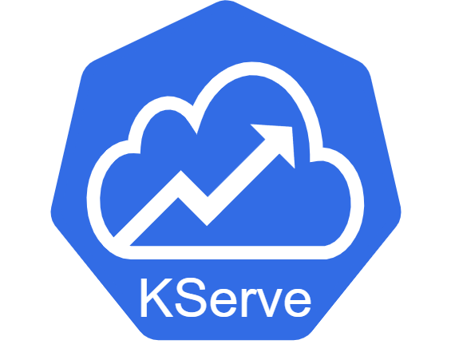
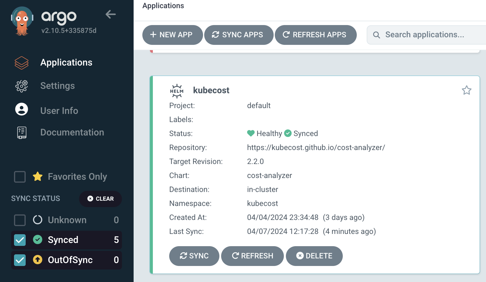
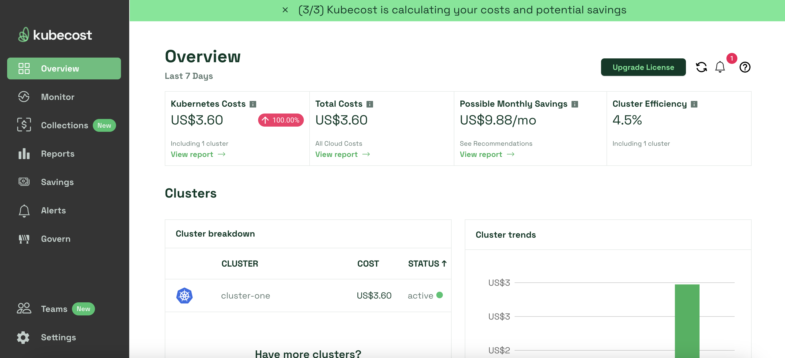
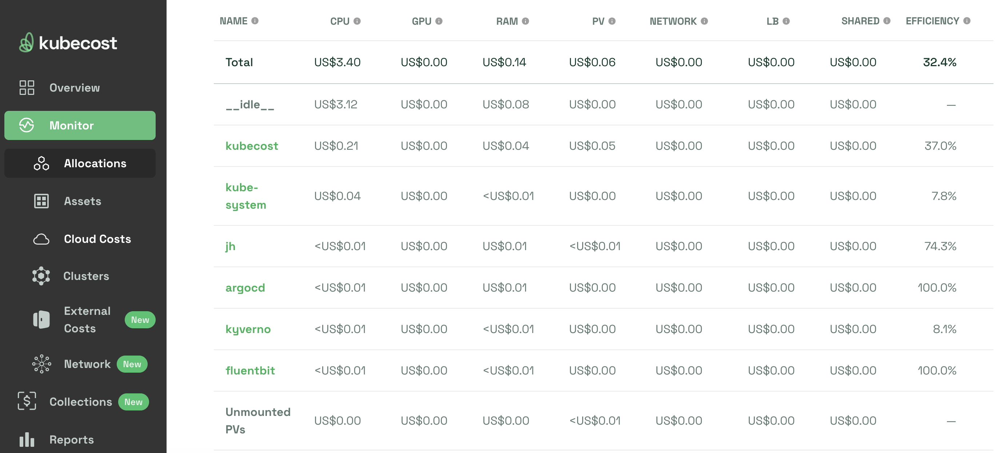

## [Back Home](../../README.md)

# KServe
## Monitor & reduce Kubernetes spend




## Table of Content
* **[Introduction](#introduction)**
* **[Getting Started with Kubecost](#getting-started-with-kubecost)**
    * **[Create kubecost namespace](#create-kubecost-namespace)**
    * **[HELM Installation](#helm-installation)**
        * **[Option 1: Via Terminal](#option-1-via-terminal)**
        * **[Option 2: Via Argo CD](#option-2-via-argo-cd)**
* **[Launching Kubecost UI](#launching-kubecost-ui)**
* **[Monitoring Costs by Application](#monitoring-costs-by-application)**
* **[Benefits of Kubecost](#benefits-of-kubecost)**
    * **[Cost Visibility and Control](#1-cost-visibility-and-control)**
    * **[Cost Optimization Recommendations](#2-cost-optimization-recommendations)**
* **[Resources](#resources)**

## Introduction
Kubecost is a monitoring application which provides real-time cost visibility and insights for teams using Kubernetes, helping you continuously reduce your cloud costs.


## Getting Started with Kubecost

### Create kubecost Namespace
Create required namespace for Kubecost resources to be placed under.
```bash
kubectl create ns kubecost
```

### Helm Installation

#### Option 1: Via Terminal
Run the following helm commands in terminal to install kubecost application into your K8 cluster.
```bash
helm repo add kubecost https://kubecost.github.io/cost-analyzer/
helm repo update

helm install kubecost kubecost/cost-analyzer -n kubecost --create-namespace \
  --set kubecostToken="aGVsbUBrdWJlY29zdC5jb20=xm343yadf98"

```
#### Option 2: Via Argo CD
If you are versed in Argo CD you may proceed to launch the Kubecost helm chart via the platform accordingly.



## Launching Kubecost UI
To obtain access to the Kubecost UI following a successful installation, enable port-forwarding with the following command:

```bash
kubectl port-forward --namespace kubecost deployment/kubecost-cost-analyzer 9090
```

You can now access the UI by visiting http://localhost:9090 in your web browser.




## Monitoring Costs by Application
You can monitor various costs of the K8 cluster by namespace, the cloud provider and via routine reporting based on your needs.



## Benefits of Kubecost

Here are two compelling reasons why Kubecost can be a valuable asset for managing your Kubernetes deployments:

### 1. **Cost Visibility and Control:**
Kubecost provides real-time insights into your Kubernetes cluster's resource consumption and associated costs. It breaks down costs by namespace, deployment, or even individual containers, allowing you to pinpoint areas for optimization and identify potential cost inefficiencies. This transparency empowers you to make informed decisions about resource allocation and avoid unnecessary cloud spending.

### 2. **Cost Optimization Recommendations:**
Kubecost goes beyond simply presenting cost data. It analyzes your resource usage and automatically generates recommendations for optimization. This might include identifying over-provisioned resources that can be scaled down or suggesting more cost-effective instance types. By leveraging these insights, you can optimize your Kubernetes infrastructure and achieve significant cost savings without compromising performance.

## Resources
- [Kubecost GitHub Repository](https://github.com/kubecost)
- [Kubecost Official Documentation](https://kubecost.io/latest/)
- [Kubecost HELM Chart](https://github.com/kubecost/cost-analyzer-helm-chart/)


Port Forward


SERVICE_HOSTNAME=$(kubectl get inferenceservice sklearn-iris -n kserve-test -o jsonpath='{.status.url}' | cut -d "/" -f 3)
curl -v -H "Host: ${SERVICE_HOSTNAME}" -H "Content-Type: application/json" "http://${INGRESS_HOST}:${INGRESS_PORT}/v1/models/sklearn-iris:predict" -d @./iris-input.json -o results.json


#### [Back to Top](#back-home)