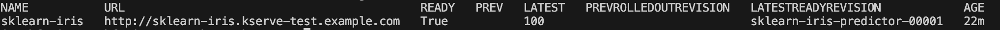

## [Back Home](../../README.md)

# KServe
## Highly scalable and standards based Model Inference Platform on Kubernetes for Trusted AI


## Table of Content
* **[Introduction](#introduction)**
* **[Getting Started with KServe](#getting-started-with-kserve)**
    * **[Setup Docker](#setup-docker)**
    * **[Install Kind (Kubernetes in Docker)](#install-kind-kubernetes-in-docker)**
    * **[Install Quickstart Environment](#install-quickstart-environment)**
* **[Creating an Inference Service](#creating-an-inference-service)**
* **[Swagger UI to Interact with Inference Service](#swagger-ui-to-interact-with-inference-service)**
* **[Benefits of KServe](#benefits-of-kserve)**
    * **[Simplified and Scalable Inference](#1-simplified-and-scalable-inference)**
    * **[Flexible and Powerful Serving](#2-flexible-and-powerful-serving)**
* **[Resources](#resources)**

## Introduction
KServe streamlines deploying machine learning models in Kubernetes. It offers a standardized inference protocol across frameworks and scales efficiently with autoscaling and density packing.  KServe empowers you to customize inference pipelines and manage advanced deployments, all within Kubernetes.


## Getting Started with KServe

### Setup Docker
Its observed that Orbstack has some configuration issues when spinning up the KServe cluster container. I recommend setting up Docker or [`Docker Desktop`](https://www.docker.com/products/docker-desktop/) for personal use to run through this setup.


### Install Kind (Kubernetes in Docker)

```bash
brew install kind
```

### Install Quickstart Environment

1. After having kind installed, create a kind cluster with:
    ```bash
    kind create cluster
    ```

2. Then run:
    ```bash
    kubectl config get-contexts
    ```

    It should list out a list of contexts you have, one of them should be kind-kind. Then run:
    ```bash
    kubectl config use-context kind-kind
    ```
    to use this context.

  3. You can then get started with a local deployment of KServe by using KServe Quick installation script on Kind:
      ```bash
      curl -s "https://raw.githubusercontent.com/kserve/kserve/release-0.12/hack/quick_install.sh" | bash
      ```


## Creating an Inference Service
### 1. Create a namespace
```bash
kubectl create namespace kserve-test
```

### 2. Create an InferenceService
```bash
kubectl apply -n kserve-test -f - <<EOF
apiVersion: "serving.kserve.io/v1beta1"
kind: "InferenceService"
metadata:
  name: "sklearn-iris"
spec:
  predictor:
    model:
      modelFormat:
        name: sklearn
      storageUri: "gs://kfserving-examples/models/sklearn/1.0/model"
EOF
```

### 3. Check InferenceService status
```bash
kubectl get inferenceservices sklearn-iris -n kserve-test
```
Expected Output:


### 4. Determine the ingress IP and ports
Execute the following command to determine if your kubernetes cluster is running in an environment that supports external load balancers
```bash
kubectl get svc istio-ingressgateway -n istio-system
```
If you are running locally like me, you will most likely not have an External IP assigned. It will be labelled `pending` throughout.

I recommend exposing your deployment through NodePort
```bash
kubectl get svc -n kserve-test
kubectl get deployments -n kserve-test
kubectl expose deployment sklearn-iris-predictor-00001-deployment -n kserve-test --type=NodePort --port=8080
kubectl get svc -n kserve-test

kubectl port-forward service/sklearn-iris-predictor-00001-deployment -n kserve-test 8080:8080
```

Alternatively you can carry out port forwarding instead.

### 5. Perform Inference
First, prepare your inference input request inside a file:
```bash
cat <<EOF > "./iris-input.json"
{
  "instances": [
    [6.8,  2.8,  4.8,  1.4],
    [6.0,  3.4,  4.5,  1.6]
  ]
}
EOF
```

Assign your host and ingress port.
```bash
export INGRESS_HOST=$(kubectl get po -l istio=ingressgateway -n istio-system -o jsonpath='{.items[0].status.hostIP}')
export INGRESS_PORT=$(kubectl -n istio-system get service istio-ingressgateway -o jsonpath='{.spec.ports[?(@.name=="http2")].nodePort}')
```

Perform Inference Locally and Output to `results.json`
```bash
SERVICE_HOSTNAME=$(kubectl get inferenceservice sklearn-iris -n kserve-test -o jsonpath='{.status.url}' | cut -d "/" -f 3)
curl -v -H "Host: ${SERVICE_HOSTNAME}" -H "Content-Type: application/json" "http://${INGRESS_HOST}:${INGRESS_PORT}/v1/models/sklearn-iris:predict" -d @./iris-input.json -o results.json
```

Expected Output:


You should see two predictions returned `(i.e. {"predictions": [1, 1]})` as the output in `results.json`. Both sets of data points sent for inference correspond to the flower with index 1. In this case, the model predicts that both flowers are "Iris Versicolour".


## Swagger UI to Interact with Inference Service
KServe ModelServer is built on top of FastAPI, which brings out-of-box support for OpenAPI specification and Swagger UI.

Swagger UI allows visualizing and interacting with the KServe InferenceService API directly in the browser, making it easy for exploring the endpoints and validating the outputs without using any command-line tool.

To enable, simply add an extra argument `args: ["--enable_docs_url=True"]` to the InferenceService YAML example from First Inference chapter:

```bash
kubectl apply -n kserve-test -f - <<EOF
apiVersion: "serving.kserve.io/v1beta1"
kind: "InferenceService"
metadata:
  name: "sklearn-iris"
spec:
  predictor:
    model:
      args: ["--enable_docs_url=True"]
      modelFormat:
        name: sklearn
      storageUri: "gs://kfserving-examples/models/sklearn/1.0/model"
EOF
```

Access link using [http://localhost:8080/docs](http://localhost:8080/docs) locally.


## Benefits of KServe

Here are two compelling reasons why KServe can be a valuable asset for managing your Kubernetes ML model deployments:

### 1. **Simplified and Scalable Inference**
KServe streamlines model deployment by providing a standard inference protocol across frameworks. This reduces complexity and enables efficient autoscaling with features like scaling to zero on GPUs, optimizing resource utilization.

### 2. **Flexible and Powerful Serving**
KServe offers a modular approach with plugins for pre-processing, post-processing, monitoring, and explainability. This allows you to tailor the inference pipeline to your specific needs and utilize advanced deployment techniques like canary rollouts and experiment management.

## Resources
- [KServe GitHub](https://github.com/kserve/kserve)
- [KServe Official Documentation](https://kserve.github.io/website/master/)
- [KServe Get Started](https://kserve.github.io/website/master/get_started/)


#### [Back to Top](#back-home)
