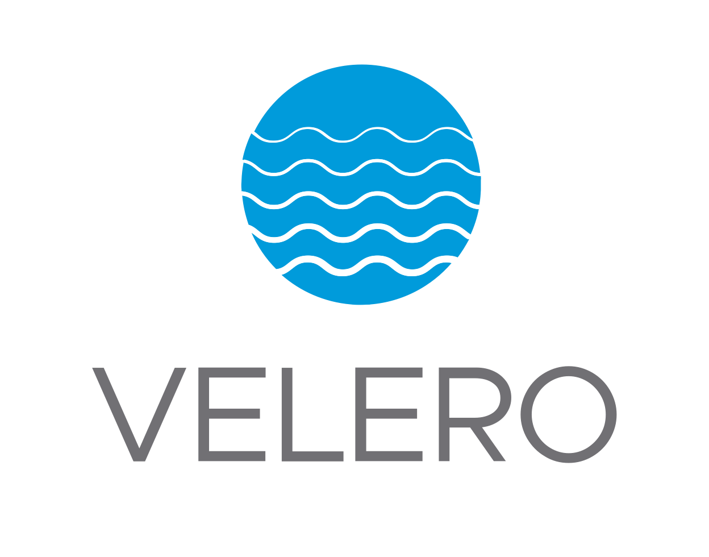

## [Back Home](../../README.md)

# Velero
## Monitor & reduce Kubernetes spend




## Table of Content
* **[Introduction](#introduction)**
* **[Getting Started with Velero](#getting-started-with-velero)**
    * **[Create velero namespace](#create-velero-namespace)**
    * **[HELM Installation](#helm-installation)**
        * **[Option 1: Via Terminal](#option-1-via-terminal)**
        * **[Option 2: Via Argo CD](#option-2-via-argo-cd)**
* **[Storage Choice for Backup](#storage-choice-for-backup)**
* **[Setup Velero CLI](#setup-velero-cli)**
* **[Backup and Restore K8 Resources](#backup-and-restore-k8-resources)**
* **[Scheduling Backups](#scheduling-backups)**
* **[Benefits of Velero](#benefits-of-velero)**
    * **[Simplified and Automated Backups](#1-simplified-and-automated-backups)**
    * **[Efficient Restores and Disaster Recovery](#2-efficient-restores-and-disaster-recovery)**
* **[Resources](#resources)**

## Introduction
Velero is an open source tool to safely backup and restore, perform disaster recovery, and migrate Kubernetes cluster resources and persistent volumes.

## Getting Started with Velero

### Create velero Namespace
Create required namespace for Velero resources to be placed under.
```bash
kubectl create ns velero
```

### Helm Installation

#### Option 1: Via Terminal
Run the following helm commands in terminal to install velero application into your K8 cluster.
```bash
helm repo add vmware-tanzu https://vmware-tanzu.github.io/helm-charts/
helm repo update

helm install vmware-tanzu/velero --namespace velero -f values.yaml --generate-name --create-namespace

```
#### Option 2: Via Argo CD
If you are versed in Argo CD you may proceed to launch the Velero helm chart via the platform accordingly.


## Storage Choice for Backup
Generally speaking, it does not make sense to deploy velero locally. For the purpose of backing up, you would need to deploy velero using either one of the cloud providers that can provide you with storage and snapshot capabilities so that you can run the relevant velero backup and restore activities to support disaster recovery. The choice of storage would include your S3 bucket and Azure Storage just to name a few. More documentation based on the cloud provider can be found below;
- [Run Velero on AWS](https://velero.io/docs/v1.0.0/aws-config/)
- [Run Velero on GCP](https://velero.io/docs/v1.0.0/gcp-config/)
- [Run Velero on Azure](https://velero.io/docs/v1.0.0/azure-config/)

## Setup Velero CLI
Velero uses CLI velero to interact with its resources. For macbook users you can simply install using homebrew.

```bash
brew install velero
```

## Backup and Restore K8 Resources

Velero provides a convenient way to manage backups and restores for your Kubernetes resources. Here's how to perform backups and restores for all resources in your cluster:

**Performing a Backup:**

1. **Run the following command to backup all resources in your cluster:**

    ```
    velero backup create backup --all-namespaces
    ```

* This command uses `velero backup create` to initiate a new backup creation.
* The `--all-namespaces` flag instructs Velero to include resources from all namespaces in the backup.

**Restoring a Backup:**

1. **List available backups:** 

    ```
    velero backup get backups
    ```

* This command displays a list of all existing backups, allowing you to identify the one you want to restore from.

2. **Run the following command to restore all resources from the chosen backup:**

    ```
    velero restore create restore --from-backup <backup-name> --all-namespaces
    ```

* Replace `<backup-name>` with the actual name of the backup you want to restore from (obtained from the previous step).
* The `--all-namespaces` flag ensures all namespaces are included in the restore process.

**Important Notes:**

* Ensure you have Velero installed and configured correctly within your Kubernetes cluster.
* Running a restore will overwrite existing resources with the state they were in during the backup. Proceed with caution and have a plan for rollback if necessary.
* Refer to the Velero documentation for more advanced options and configuration details

## Scheduling Backups

Here's how to schedule a Velero backup for all resources in your cluster:

**1. Using the `velero backup create` command:**

```
velero backup create schedule --schedule <cron-expression> --all-namespaces
```

* Replace `<cron-expression>` with the desired cron expression that defines the scheduling pattern. Here are some common examples:
    * `@hourly`: Runs a backup every hour.
    * `0 0 * * *`: Runs a backup daily at midnight.
    *  For more complex schedules, refer to cron documentation: [https://crontab.guru/](https://crontab.guru/)

* The `--all-namespaces` flag ensures the backup includes resources from all namespaces.

**2. Specifying a Backup Name (Optional):**

  ```bash
  velero backup create schedule --schedule <cron-expression> --all-namespaces --from-template <backup-name-template>
  ```

* The `--from-template <backup-name-template>` flag allows you to define a template for naming the backups created by the schedule. This can be helpful for organizing and identifying backups based on the schedule. Velero will automatically generate the final name based on the template and timestamp.

**Explanation:**

This approach uses the `velero backup create` command with the `schedule` subcommand. This subcommand defines a recurring backup task based on the provided cron expression. The `--all-namespaces` flag ensures all namespaces are included in the backup. Additionally, you can optionally specify a template for naming the backups using the `--from-template` flag.

**Benefits of Scheduling Backups:**

* **Automated and Consistent:** Scheduling backups ensures regular backups occur automatically without manual intervention, promoting consistency and reducing the risk of missing backups.
* **Disaster Recovery:** Having scheduled backups provides a recovery point in case of incidents like accidental resource deletion or cluster failures.
* **Peace of Mind:** Knowing your resources are backed up regularly offers peace of mind and allows you to focus on other tasks.

## Benefits of Velero

Velero offers several advantages for managing backups and restores within your Kubernetes clusters. Here are two compelling reasons to consider using Velero:

### 1. **Simplified and Automated Backups**
Velero streamlines the backup process by eliminating the need for manual scripting or complex commands. It allows you to easily schedule recurring backups for all or specific resources within your cluster using cron expressions. This automation ensures consistent backups and reduces the risk of missing critical data points.

### 2. **Efficient Restores and Disaster Recovery**
In case of accidental resource deletion, cluster failures, or other unexpected events, Velero facilitates quick and efficient restores. You can restore entire clusters or specific resources from previous backups, allowing you to recover from disasters and minimize downtime. Velero's point-in-time restores enable you to roll back to a specific state, offering greater control and flexibility during the recovery process. 

## Resources
- [Velero Official Documentation](https://velero.io/)
- [Velero HELM Chart](https://github.com/vmware-tanzu/helm-charts/tree/main/charts/velero)

#### [Back to Top](#back-home)