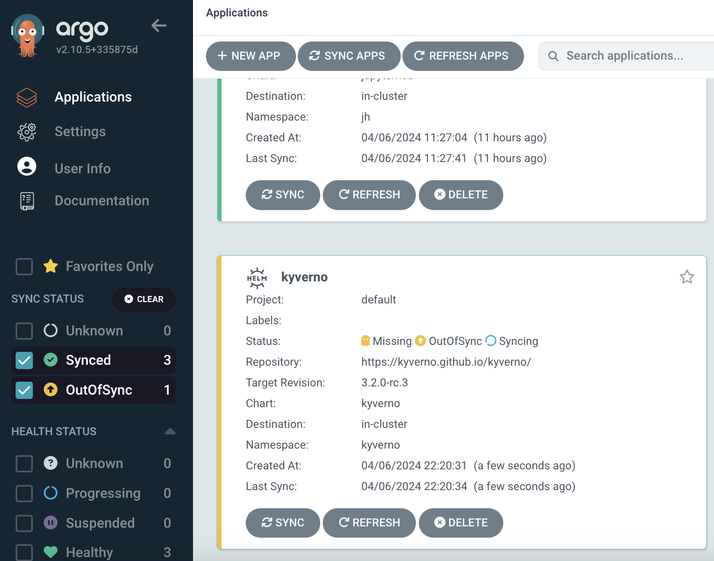

## [Back Home](../README.md)

# Kyverno
## Kubernetes Native Policy Management 


## Table of Content
* **[Introduction](#introduction)**
* **[Getting Started with Kyverno](#getting-started-with-kyverno)**
    * **[Create kyverno namespace](#create-kyverno-namespace)**
    * **[HELM Installation](#helm-installation)**
        * **[Option 1: Via Terminal](#option-1-via-terminal)**
        * **[Option 2: Via Argo CD](#option-2-via-argo-cd)**
* **[Applying Kyverno Policies](#applying-kyverno-policies)**
* **[Benefits of Kyverno](#benefits-of-kyverno)**
    * **[1. Policy as Code with Familiar Tools](#1-policy-as-code-with-familiar-tools)**
    * **[2. Enforce Security and Configuration Best Practices](#2-enforce-security-and-configuration-best-practices)**

* **[Resources](#resources)**

## Introduction
Kyverno, meaning "govern" in Greek, simplifies policy management within your Kubernetes clusters.  It offers a policy-as-code approach using familiar tools like Git and Kustomize, eliminating the need to learn a new language. Kyverno enforces policies across your cluster, allowing you to validate, mutate, or even block deployments that violate your security or configuration best practices. It also provides features like image verification, self-service reporting, and policy testing, making it a comprehensive solution for governing your Kubernetes deployments.


## Getting Started with Kyverno

### Create kyverno Namespace
Create a namespace for Kyverno resources to be placed under.
```bash
kubectl create ns kyverno
```

### Helm Installation

#### Option 1: Via Terminal
Run the following helm commands in terminal to install kyverno application into your K8 cluster.
```bash
helm repo add kyverno https://kyverno.github.io/kyverno/
helm install kyverno --namespace kyverno kyverno/kyverno --create-namespace
```
#### Option 2: Via Argo CD
If you are versed in Argo CD you may proceed to launch the Kyverno helm chart via the platform accordingly.



## Applying Kyverno Policies
There are many policies you can reference and apply into your cluster from https://kyverno.io/policies/

In this demo we will mainy apply the following policies;
- `disallow-priviledge-containers.yaml`
- `disallow-priviledge-escalation.yaml`

Running the above policies would allow Kyverno to block priviledge containers and priviledge escalation from happening within your cluster. Under the policies folder, to enable the policies, run the following;

```bash
kubectl apply -f . -n kyverno
```

## Benefits of Kyverno

Kyverno simplifies and strengthens governance within your Kubernetes clusters. Here are two key advantages it offers:

### 1. **Policy as Code with Familiar Tools:**
Kyverno empowers you to manage policies as code using Git and Kustomize, eliminating the need to learn a new language. This streamlines policy management and leverages existing workflows for version control and deployment.

### 2. **Enforce Security and Configuration Best Practices:** 
Kyverno enforces policies across your cluster, validating, mutating, or even blocking deployments that violate security or configuration best practices. This proactive approach safeguards your cluster by ensuring deployments adhere to your defined standards.


## Resources
- [Kyverno GitHub](https://github.com/kyverno/kyverno)
- [Kyverno Helm Charts Doc](https://kyverno.github.io/kyverno/)


#### [Back to Top](#back-home)